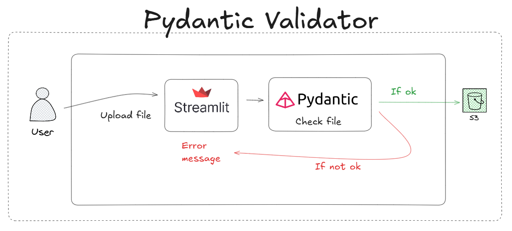

# Pydantic Validation – S3 File Import
This project provides a Streamlit-based interface to upload files to an S3-compatible bucket (using MinIO as the storage backend).
Before files are stored, their metadata and content are validated using Pydantic, ensuring compliance with predefined rules and data integrity.

## 📺 YouTube Video
Link: 

## Architecture


## Prerequisites
- Git
- Docker
- Docker Compose
- Python 3.7+ (recommended)

## Libs
```
streamlit==1.46.0,
boto3==1.40.6
python-dotenv==1.1.1
pydantic==2.11.7
```

## Tools Overview
### Docker
Docker is a containerization platform that packages applications and their dependencies into isolated containers to run anywhere.

### MinIO / S3
MinIO is a high-performance, S3-compatible object storage server. It supports the Amazon S3 API, enabling use of existing S3 tools and SDKs.

## How to Install Docker?
You can follow this tutorial: 

https://www.youtube.com/watch?v=pRFzDVn40rw&list=PLbPvnlmz6e_L_3Zw_fGtMcMY0eAOZnN-H

## How to Use the Project?
Clone the repository:
```
git clone https://github.com/wlcamargo/pydantic_validator.git
```
```
cd pydantic_validator
```

## How to Start the MinIO Container?

```
cd src/minio
docker compose up -d
```

### How to Access Minio?
Open your browser and go to:

http://localhost:9000

Minio Credentials  
| Username  | Password    |  
| --------- | ----------- |  
| chapolin  | mudar@123   |

### How to run front end?

#### Create a Virtual Environment

##### On Linux/macOS:

```bash 
python3 -m venv venv
```
##### On Windows:

```bash Windows
python -m venv venv
```

#### Activate the Virtual Environment

##### On Linux/macOS:

```bash
source venv/bin/activate
```

##### On Windows:

```bash
venv\Scripts\activate
```

#### Install Python Dependencies

```bash
pip install -r requirements.txt
```

#### Execute the command to start application
```
cd src/pydantic_validator
streamlit run app.py
```

Open your browser and go to:

http://localhost:8501

App layout:


## Conclusion
If you’ve reached this point, great job! 🎉
You now have a complete example of how to upload and validate files using Pydantic and store them in an S3 bucket (via MinIO) with Streamlit as the frontend.

## 📚 References
- [Pydantic](https://docs.pydantic.dev/latest/)
- [Streamlit docs](https://docs.streamlit.io)  
- [MinIO docs](https://min.io/docs/)  
- [AWS S3 docs](https://docs.aws.amazon.com/s3/index.html)

## 🧑🏼‍🚀 Developer
| Developer      | LinkedIn   | Email               | Portfolio   |  
| -------------- | ---------- | ------------------- | ----------- |  
| Wallace Camargo | [LinkedIn](https://www.linkedin.com/in/wallace-camargo-35b615171/) | wallacecpdg@gmail.com | [Portfólio](https://wlcamargo.github.io/)  |  
